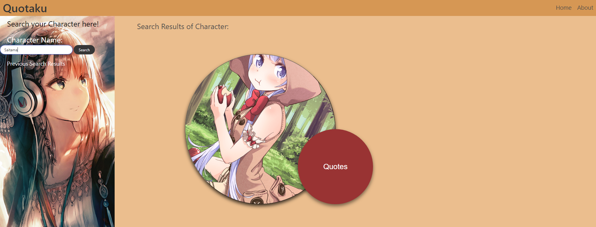
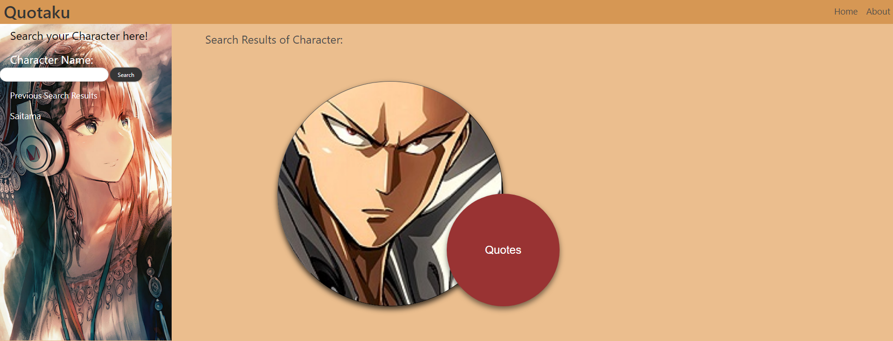

# Quotaku

## General Information

Interested in using Quotaku!
 Imagine a situation where you are watching your favorite TV show and wanted to find a quick way to get to know more about your favorite character.
 Well that is what our ease of use application is for!
 Quotaku allows you to search your favorite character and find those famous quotes for you.  
Let us do the work so you have more time watching those favorite shows!

## Walkthrough:

When you land on the Quotaku homepage, you would look for the search text box.

Enter the character that you are interested in looking into further:

Select "Search" and you would see the preview photo of the character should be populated based upon user input:

Select the previewed character and you would see the dynamic image and quotes:

## Set-up:

Bulma - CSS Framework

## Contributors:

Dtrieu1, svnkite, s0m3y3, biancawonka

## Credits:

Anime Chan API: https://animechan.xyz
My Anime List API: https://myanimelist.net/
Jikan API: https://jikan.moe/

Third Party:
Rapid API: https://rapidapi.com/hub

Deployed Application Link: https://s0m3y3.github.io/Quotaku/

Github Link: https://github.com/s0m3y3/Quotaku
